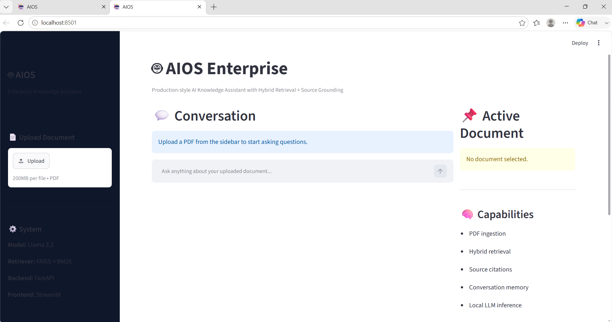
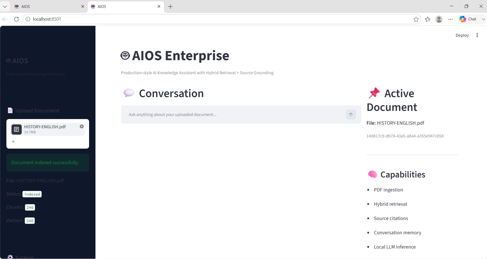
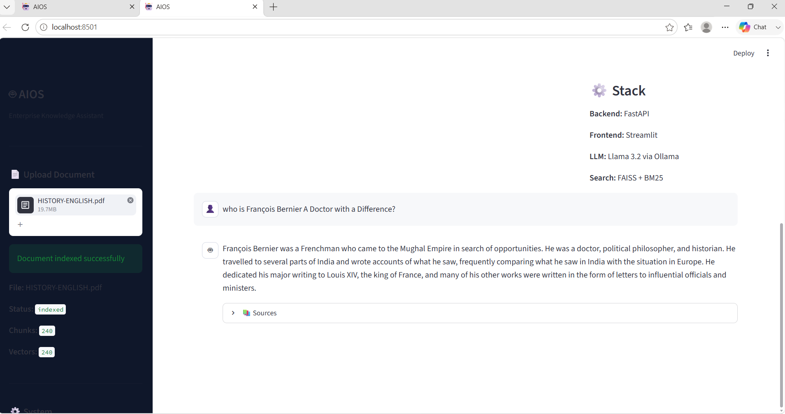
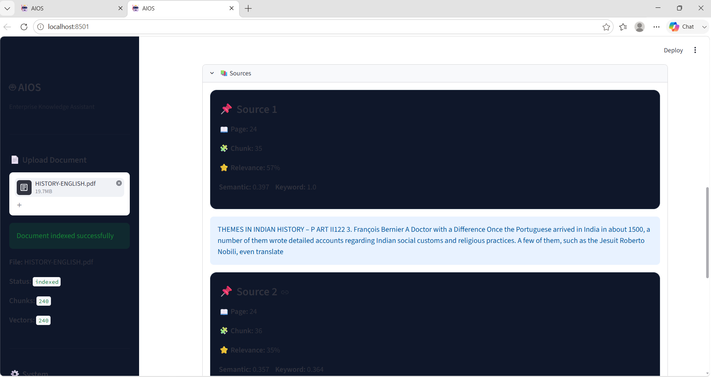
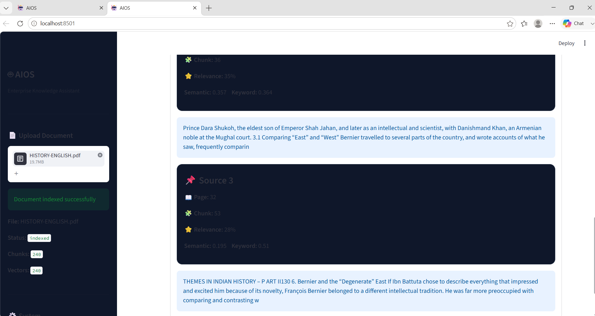
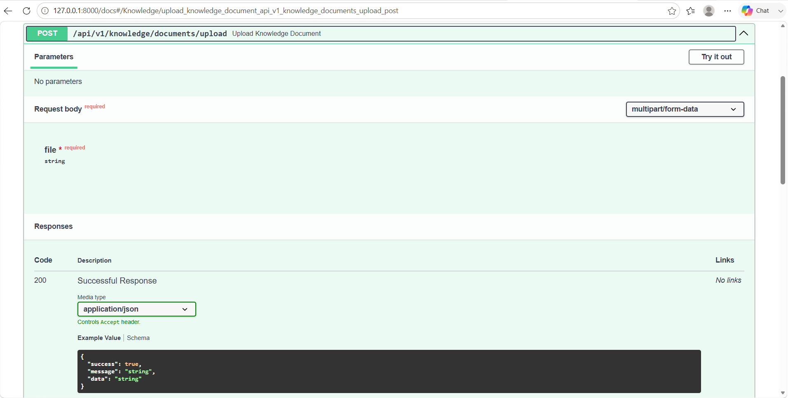
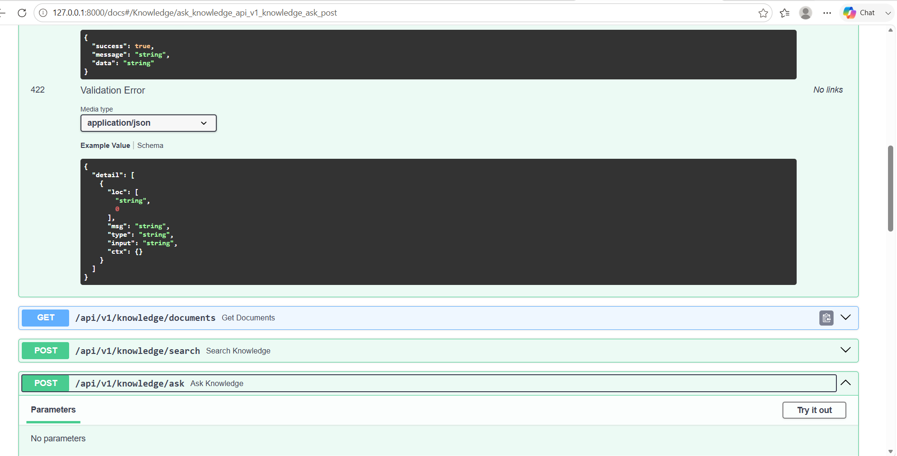

<p align="center">
  
</p>

Enterprise-Inspired Retrieval-Augmented Generation (RAG) Assistant


 **Live Demo**

 **Frontend:** https://lwcx6yd82raq7jcc3dzphg.streamlit.app/

**Backend API:** https://aios-1.onrender.com

**API Docs (Swagger):** https://aios-1.onrender.com/docs

AIOS: A Local, Hybrid RAG Application

I built AIOS to get my hands dirty with the actual engineering side of production AI applications, moving past simple API wrappers. It’s a local, enterprise-grade Retrieval-Augmented Generation (RAG) system that lets you drop in PDFs and have grounded, natural language conversations with your data.

Instead of just tossing text at an LLM, this project focuses heavily on the mechanics of ingestion, chunking strategies, and balancing semantic depth with exact keyword matching using a custom hybrid retrieval pipeline.

 What it Does
Smart Ingestion: Automatically parses, cleans, and chunks uploaded PDFs.

Hybrid Retrieval: Fuses semantic search (FAISS + Sentence Transformers) with traditional keyword search (BM25) to make sure the LLM actually gets the right context.

Flexible LLM Backend: AIOS supports both local inference with Ollama (Llama 3.2) and cloud-hosted OpenAI-compatible providers through environment variables, allowing the same retrieval pipeline to run locally or in production.

Citational Grounding: Responses aren't just generated out of thin air; the app explicitly surfaces the source chunks used to build the answer.

Session Memory: Keeps track of chat history using session IDs for continuous conversations.

Clean Architecture: Built with a decoupled FastAPI backend and a lightweight Streamlit UI, all ready to be containerized via Docker.

 How it Works under the Hood
The data pipeline follows a classic modular architecture:

[Upload PDF] ➔ [PyPDF Extraction] ➔ [Text Cleaning & Chunking]
                                               │
                    ┌──────────────────────────┴──────────────────────────┐
                    ▼                                                     ▼
     [Vector Embeddings Generator]                                 [Tokenization]
                    │                                                     │
                    ▼                                                     ▼
         [FAISS Index (Semantic)]                             [BM25 Index (Keyword)]
                    │                                                     │
                    └──────────────────────────┬──────────────────────────┘
                                               ▼
                                    [Hybrid Rank Fusion]
                                               │
                                               ▼
                             [Top-K Context + Configurable LLM Backend] ➔ [Grounded Response]
Ingestion & Processing: The PDF is stripped to raw text via PyPDF, cleaned of formatting artifacts, and broken into overlapping chunks to preserve context at the boundaries.

Dual-Indexing: Chunks are simultaneously vectorized using all-MiniLM-L6-v2 for the FAISS vector store and tokenized for the BM25 keyword index.

Query & Fusion: When you ask a question, AIOS hits both indexes. Semantic search catches the conceptual meaning, while BM25 catches exact IDs, names, or specific terminology. The results are merged to pull the absolute best reference text.

Generation: The final context window is structured and sent to the configured language model. Local development uses Ollama, while cloud deployments can use a hosted OpenAI-compatible provider without changing the retrieval pipeline.

 Tech Stack
Core: Python 3.11

API & Backend: FastAPI (REST)

UI Frontend: Streamlit

LLM Support:

- Ollama (Llama 3.2) for local development
- OpenAI-compatible hosted providers for cloud deployment

Vector Embeddings: Sentence Transformers (all-MiniLM-L6-v2)

Vector Database: FAISS

Keyword Search: BM25

Deployment: Docker / Docker Compose


Live Demo

**Backend API:** https://aios-1.onrender.com

**API Documentation:** https://aios-1.onrender.com/docs

> Streamlit frontend deployment coming soon.

Configuration

AIOS supports multiple language model providers.

Local Development

```env
LLM_PROVIDER=ollama
OLLAMA_URL=http://localhost:11434/api/generate
OLLAMA_MODEL=llama3.2
```

Cloud Deployment

```env
LLM_PROVIDER=openai
OPENAI_API_KEY=your_api_key
OPENAI_MODEL=gpt-4o-mini
EMBEDDING_PROVIDER=openai
OPENAI_EMBEDDING_MODEL=text-embedding-3-small
```

The retrieval pipeline remains identical in both modes. Only the language model backend changes.


Project Structure
Plaintext
AIOS/
├── assets/             # Graphics and UI elements
├── backend/            # The heavy lifting
│   ├── api/            # FastAPI endpoints & routers
│   ├── core/           # LLM orchestration & RAG pipeline logic
│   ├── modules/        # Chunking, embedding, and indexing engines
│   └── schemas/        # Pydantic data models
├── data/               # Local storage for uploads and index files
├── docs/               # Architecture notes
├── frontend/           # Streamlit interface
│   └── app.py
├── scripts/            # Utility and setup scripts
├── tests/              # Unit and integration tests
├── Dockerfile
├── docker-compose.yml
├── requirements.txt
└── start_aios.ps1       # One-click bootstrap script
 Getting Started
1. Clone & Navigate
Bash
git clone https://github.com/<your-username>/AIOS.git
cd AIOS
2. Environment Setup
Set up a clean virtual environment to keep dependencies isolated:

Windows:

PowerShell
python -m venv venv
.\venv\Scripts\activate
Linux/macOS:

Bash
python3 -m venv venv
source venv/bin/activate
Install the dependencies:

Bash
pip install -r requirements.txt
3. Spin up the Local LLM
Make sure you have Ollama installed on your system, then pull the model weights and start the engine:

Bash
Pull Llama 3.2
ollama pull llama3.2

Fire up the local server
ollama serve
4. Run the App
If you are on Windows, you can use the automation script to launch everything at once:

PowerShell
.\start_aios.ps1
Otherwise, pull open two terminal tabs to run the services independently:

Tab 1 (Backend):

Bash
python -m uvicorn backend.main:app --host 127.0.0.1 --port 8000
Tab 2 (Frontend):

Bash
streamlit run frontend/app.py
Once up, open your browser to the local Streamlit address (usually http://localhost:8501), drop in a document, and start testing the retrieval performance!

**Screenshots**
Application Preview

The following screenshots demonstrate the complete AIOS workflow, from document ingestion to question answering and API documentation.

---

1. Home Dashboard

The main landing page of AIOS where users can upload PDF documents and begin interacting with the assistant.



---

2. Document Upload

Uploading a PDF automatically triggers the ingestion pipeline, including text extraction, chunking, embedding generation, and indexing.



---

3. Chat Interface

Users can ask questions in natural language and receive grounded responses generated from the uploaded documents.



---

4. Source Citations

Every response includes supporting document chunks, allowing users to verify exactly where the generated answer originated.



---

5. Expanded Source Details

Each retrieved source can be expanded to inspect the chunk content and better understand why it contributed to the final answer.



---

6. FastAPI Swagger UI

AIOS exposes a REST API using FastAPI. The interactive Swagger documentation provides a simple way to explore every endpoint.



---

7. Upload Endpoint

Detailed view of the document upload endpoint, including request parameters and expected responses.



---

8. Question Answering Endpoint

Swagger documentation for the question-answering endpoint used by the Streamlit frontend.


---

9. API Request Example

Example request payload for querying AIOS through the REST API.


Demo

A short walkthrough of AIOS is available below.

> Demo video coming soon.

Using the App
Once your backend, frontend, and configured LLM provider are running (Ollama locally or a hosted provider in production), head over to the Streamlit local URL in your browser. The loop is straightforward:

Drop your PDF into the upload zone.

Wait a brief moment while the background pipeline handles the parsing and indexing.

Start chatting naturally with your document.

Verify the outputs by checking the interactive source blocks that reveal exactly which pages or text sections the model used.

 Deep Dive: Under the Hood
While the UI keeps things simple, there's a lot moving under the surface to prevent the LLM from hallucinating or losing context.

Ingestion & Optimization
The preprocessing pipeline runs exactly once per document upload. It isn't just dumping raw text into a database; it strips junk whitespace, normalizes formatting artifacts, and applies an overlapping character split strategy. This keeps important concepts from getting sliced in half right at a chunk boundary.

The Power of Hybrid Retrieval
RAG systems often struggle if they rely entirely on vector math. Pure semantic search (FAISS) is incredible at capturing conceptual context, but it frequently whiffs on specific nouns, exact version numbers, or rare terminology.

To fix this, AIOS uses Reciprocal Rank Fusion (RRF) to combine semantic scores with BM25 keyword search.

BM25 acts as a safety net for exact matches (like looking for a specific project name, error code, or ID).

FAISS catches the intent when you phrase a question using completely different vocabulary than the document.

Context Engineering & Prompt Construction
Instead of overloading Llama 3.2 with a massive, unfiltered wall of text, AIOS dynamically compiles a highly structured prompt context window containing:

Short-term dialogue history (tracked via your session_id).

Strict behavioral instructions forcing the model to stay grounded.

The precise Top-K relevant document fragments.

This keeps inference lightweight, rapid, and tightly bounded to facts.

Transparent Citations
To move away from the "black box" nature of typical AI tools, every response explicitly links back to its underlying raw data. You can expand the source cards to view the direct chunk snippet, its collection index, and the mathematical confidence score behind the retrieval.

 API Reference
AIOS exposes its entire RAG pipeline through clean FastAPI REST endpoints, making it simple to bypass the Streamlit UI entirely and integrate it into other workflows.

1. Index a Document
HTTP
POST /api/v1/knowledge/documents/upload
Accepts a multipart form PDF upload, kicks off the extraction worker, builds your vector/keyword structures, and registers the document ID.

2. Query the Engine
HTTP
POST /api/v1/knowledge/ask
Executes the hybrid search strategy and passes the context to the local model instance.

Example Request payload:

JSON
{
  "session_id": "dev-sandbox-session",
  "document_id": "project-spec-v2",
  "question": "What core tech stack constraints are outlined?",
  "top_k": 3
}
Example Response payload:

JSON
{
  "success": true,
  "message": "Answer generated successfully",
  "data": {
    "answer": "The project uses Python 3.11 with a configurable LLM backend and a hybrid retrieval pipeline for grounded responses.",
    "sources": [
      {
        "chunk_index": 14,
        "score": 0.8842
      }
    ]
  }
}
 Interface Preview
Here is a quick look at the system UI and API sandbox:

Main Dashboard
Document Ingestion Worker
Contextual Chat Mode
Source Attribution Logs
Interactive OpenAPI Documentation
Architecture & Design Choices
Every component in AIOS was selected to keep the system fast, modular, and completely self-contained on a local machine. Here is the reasoning behind the core architecture:

FastAPI: Serves as a lightweight, high-performance async backend. It gives us out-of-the-box data validation via Pydantic and generates interactive OpenAPI/Swagger docs automatically, which keeps API development smooth.

Streamlit: Chosen purely for speed of execution on the frontend. Utilizing Streamlit meant zero time wasted on boilerplate UI/UX, letting the focus stay entirely on refining the core RAG logic and indexing pipeline.

FAISS: A highly efficient vector similarity library that delivers lightning-fast semantic retrieval. It keeps the deployment footprint incredibly light by running entirely in-memory without requiring a heavyweight external cluster.

BM25: Vector math can easily look past specific identifiers, alpha-numeric serial numbers, proper nouns, or exact terminology. BM25 acts as a deterministic keyword safety net, catching the exact phrases that vector embeddings might compress away.

Configurable LLM Layer: AIOS separates retrieval from text generation. Local development uses Ollama, while production deployments can switch to a hosted OpenAI-compatible provider using environment variables without changing the application logic.

Performance & Constraints
Operational Trade-offs
Because embeddings must be generated for every text segment, document indexing is the heaviest operation in the pipeline. However, because this is an intentional one-time upfront cost, subsequent queries and rank fusions complete in a fraction of a second.

Current Bounding Box
AIOS was designed as a local, single-user sandbox to master the foundational mechanics of RAG engineering. To maintain a sharp project scope, the following architecture constraints were intentionally accepted:

State and session histories are maintained in active memory rather than a persistent DB.

File storage and processing are optimized strictly for native text-based PDFs.

Authentication layers are omitted in favor of local-host deployment execution.

Project Status

AIOS is currently under active development.

Current capabilities include:

- Hybrid Retrieval (FAISS + BM25)
- PDF ingestion
- Configurable LLM backend (Ollama locally / hosted provider in production)
- Source-grounded responses
- Session-based conversation memory
- FastAPI REST API
- Streamlit frontend

 Roadmap & Next Horizons

To take AIOS from a high-performance local pipeline to a production-ready enterprise cluster, future development is focused on:

[ ] Infrastructure Scaling: Migrating session states to Redis caches and scaling document metadata management into a robust PostgreSQL layer.

[ ] Advanced Ingestion: Integrating OCR engines for scanned documents and implementing layout-aware parsers to extract structured tables and inline imagery.

[ ] Streaming Architecture: Refactoring the FastAPI-to-Streamlit pipeline to stream tokens in real-time, lowering the perceived latency of long responses.

[ ] Enterprise Security: Implementing multi-tenant isolation, user authentication, and granular role-based access control.

 Engineering Takeaways
Building AIOS made one thing incredibly clear: the ultimate quality of a RAG system depends far more on data preprocessing and retrieval quality than on the raw power of the LLM itself.

This project provided deep, hands-on experience in balancing precision and recall, optimizing text chunking boundaries, orchestrating multi-service architectures, and handling state across independent backend and frontend services.

 Contributing
Got an idea to optimize the chunking strategy or speed up the fusion ranking? Contributions are welcome.

Fork the project repository.

Cut a clean feature branch (git checkout -b feature/AmazingFeature).

Commit your changes (git commit -m 'Add some AmazingFeature').

Push to the branch (git push origin feature/AmazingFeature).

Open a detailed Pull Request.

 License
Distributed under the MIT License. See LICENSE for more information.

 ## Author

**S.R. Deekshitha**

B.Tech – Computer Science Engineering (Artificial Intelligence & Machine Learning)

I'm passionate about building practical AI systems with a focus on Retrieval-Augmented Generation (RAG), Information Retrieval, Natural Language Processing, and scalable backend development.

GitHub:
https://github.com/deekshitha15103-del

LinkedIn:
https://www.linkedin.com/in/deekshitha-s-r-31bb24289

 Acknowledgements
AIOS stands on the shoulders of the incredible open-source AI and backend communities. Major thanks to the contributors behind:

FastAPI & Streamlit — For making the Python web ecosystem incredibly productive.

FAISS & Sentence Transformers — For democratic access to elite-tier vector search tooling.

Ollama — For enabling efficient local LLM development.

OpenAI-compatible APIs — For enabling cloud deployment using the same application architecture.

____

If you found this project interesting, consider giving it a ⭐ on GitHub.

Feedback, suggestions, and contributions are always welcome.
